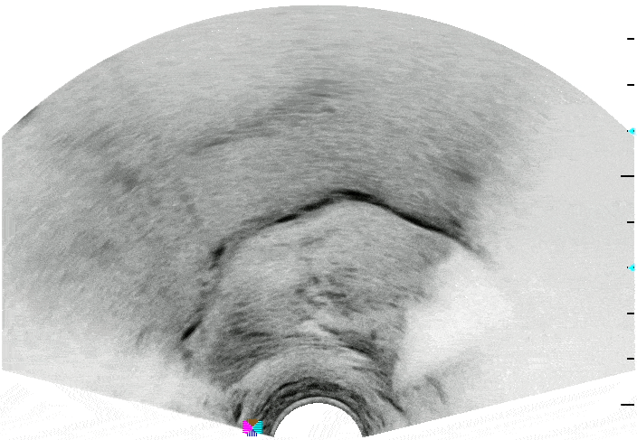
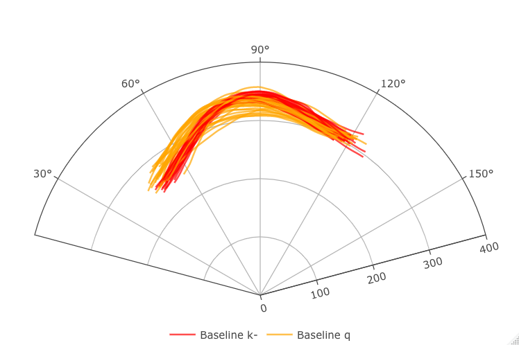
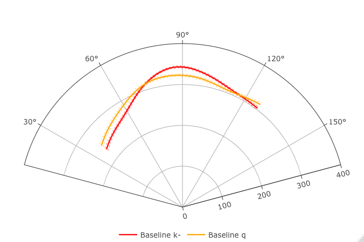

> 超音波只能用來看小寶寶嗎？

> 你知道超音波也能用來觀看並量測不同的發音部位嗎？

> 想更了解超音波在語音學上的最新應用嗎？

## ➲ 2021 臺大超音波工作坊將帶你一窺究竟！

---

## **工作坊介紹**

超音波儀近年來在`語音相關研究`上，逐漸成為國內外學界相當重要的研究利器。鑑於超音波的`非侵入性`特質以及`即時成影`的技術，超音波儀特別適合用來`量測舌部運動`與`舌形姿態`。本工作坊將介紹超音波在`舌部運動`的研究與應用，同時也規劃了實作課程，包括`舌頭運動即時影像的錄製`、`影像資料擷取與後處理`，以及介紹當前較為普遍的`統計分析`。臺大語言所發音行為與科學實驗室的老師以及研究生，手把手帶你瞭解超音波、解析口腔的發音運動！

---

## **工作坊流程**

工作坊日期：**2021 年 11 月 27 日 (星期六)**

<table>
  <thead>
    <tr>
      <th align="center">時間</th>
      <th align="center">主題</th>
      <th align="center">講者</th>
      <th align="center">參考資料</th>
    </tr>
  </thead>
  <tbody>
    <tr>
      <td align="center">09:00 ~ 09:20</td>
      <td align="center">報到</td>
      <td align="center"></td>
      <td align="left"></td>
    </tr>
    <tr>
      <td align="center">09:20 ~ 10:10</td>
      <td align="center">語音研究的新利器：超音波</td>
      <td align="center">
        <a href="https://sites.google.com/site/chiuchenhao/" rel="nofollow"
          >邱振豪</a
        >
      </td>
      <td align="left"></td>
    </tr>
    <tr>
      <td align="center">10:10 ~ 11:00</td>
      <td align="center">超音波是什麼？</td>
      <td align="center">翁益寧</td>
      <td align="left"></td>
    </tr>
    <tr>
      <td align="center">11:00 ~ 11:10</td>
      <td align="center">Break</td>
      <td align="center"></td>
      <td align="left"></td>
    </tr>
    <tr>
      <td align="center">11:10 ~ 12:00</td>
      <td align="center">超音波原來可以這樣看</td>
      <td align="center">邱振豪</td>
      <td align="left"></td>
    </tr>
    <tr>
      <td align="center"></td>
      <td align="center"></td>
      <td align="center"></td>
      <td align="left"></td>
    </tr>
    <tr>
      <td align="center">12:00 ~ 13:00</td>
      <td align="center">Lunch break</td>
      <td align="center"></td>
      <td align="left"></td>
    </tr>
    <tr>
      <td align="center"></td>
      <td align="center"></td>
      <td align="center"></td>
      <td align="left"></td>
    </tr>
    <tr>
      <td align="center">13:30 ~ 13:50</td>
      <td align="center">超音波動手玩！</td>
      <td align="center">翁益寧</td>
      <td align="left"></td>
    </tr>
    <tr>
      <td align="center">13:50 ~ 14:40</td>
      <td align="center">舌位捉迷藏</td>
      <td align="center"><a href="https://github.com/Rayologist">陳博煒</a></td>
      <td align="left"></td>
    </tr>
    <tr>
      <td align="center">14:40 ~ 14:50</td>
      <td align="center">Break</td>
      <td align="center"></td>
      <td align="left"></td>
    </tr>
    <tr>
      <td align="center">14:50 ~ 15:40</td>
      <td align="center">舌位怎麼比？-- 擬合法</td>
      <td align="center">賴景泓</td>
      <td align="left">
        1. SSANOVA:
        <a
          href="https://asa.scitation.org/doi/abs/10.1121/1.2205133"
          rel="nofollow"
          >Davidson (2006)</a
        > 2. GAMM:
        <a
          href="https://www.sciencedirect.com/science/article/abs/pii/S0095447017301377"
          rel="nofollow"
          >Wieling (2018)</a
        >
      </td>
    </tr>
    <tr>
      <td align="center">15:40 ~ 16:30</td>
      <td align="center">舌位怎麼比？-- 主成份分析法</td>
      <td align="center">黃柏瑄</td>
      <td align="left"></td>
    </tr>
    <tr>
      <td align="center">16:30 ~ 17:00</td>
      <td align="center">綜合討論 Q&amp;A</td>
      <td align="center"></td>
      <td align="left"></td>
    </tr>
  </tbody>
</table>

<!-- Original Markdown -->
<!-- |     時間      |            主題             |  講者  |   參考資料    |
| :-------------: | :-------------------------: | :----: | :----- |
| 9:00 ~ 9:30 |            報到            |        |  |
| 9:30 ~ 10:10  |  語音研究的新利器：超音波       | [邱振豪](https://sites.google.com/site/chiuchenhao/) |  |
| 10:10 ~ 10:20 |            Break            |        |  |
| 10:20 ~ 11:00 |       超音波是什麼？          | 翁益寧 |  |
| 11:00 ~ 11:10 |            Break            |        |  |
| 11:10 ~ 12:00 |    超音波原來可以這樣看        | 邱振豪 |  |
|               |                             |        |  |
| 12:00 ~ 13:30 |         Lunch break         |        |  |
|               |                             |        |  |
| 13:30 ~ 14:00 |       超音波動手玩！           | 翁益寧 |  |
| 14:00 ~ 14:40 |         舌位捉迷藏            | [陳博煒](https://github.com/Rayologist) |  |
| 14:40 ~ 14:50 |            Break            |        |  |
| 14:50 ~ 15:30 |    舌位怎麼比？-- 擬合法       | 賴景泓 | 1. SSANOVA: [Davidson (2006)](https://asa.scitation.org/doi/abs/10.1121/1.2205133) 2. GAMM: [Wieling (2018)](https://www.sciencedirect.com/science/article/abs/pii/S0095447017301377) |
| 15:30 ~ 15:40 |            Break            |        |  |
| 15:40 ~ 16:20 | 舌位怎麼比？-- 主成份分析法     | 黃柏瑄 |  |
| 16:20 ~ 17:00 |        綜合討論 Q&A         |        |  | -->

---

## **講者介紹**

|  講者  |                         介紹                         |
| :----: | :--------------------------------------------------: |
| [邱振豪](https://sites.google.com/site/chiuchenhao/) | 國立臺灣大學語言所副教授、發音行為與科學實驗室主持人 |
| 翁益寧 |               國立臺灣大學語言所博士生               |
| [陳博煒](https://github.com/Rayologist) |               國立臺灣大學語言所碩士生               |
| 賴景泓 |               國立臺灣大學語言所碩士生               |
| 黃柏瑄 |               國立臺灣大學語言所碩士生               |

---

## **會場路線圖**

地點：國立臺灣大學博雅教學館 201 教室

會場路徑：

1. 公館捷運站三號出口
2. 延圍牆至台大校門口
3. 行經椰林大道，右轉至垂葉榕道
4. 直走，博雅教學館會在您的右手邊

[**點我看完整台大地圖**](https://www.ntu.edu.tw/about/map/B_02_A.jpg)

[**點我看 Google Map**](https://www.google.com/maps/place/%E5%9C%8B%E7%AB%8B%E8%87%BA%E7%81%A3%E5%A4%A7%E5%AD%B8%E5%8D%9A%E9%9B%85%E6%95%99%E5%AD%B8%E9%A4%A8/@25.0188496,121.5345114,17z/data=!3m1!4b1!4m5!3m4!1s0x3442a989d9909417:0x13a8ef0043681664!8m2!3d25.0188448!4d121.5367001)

---

## **報名資訊**

- 報名人數： 40 人 **（若疫情放緩，將開放更多報名人數）**
- 報名期間： 即日起，額滿為止。 **（報名成功者，將寄信通知。）**
- 報名連結： [點我報名！](https://forms.gle/skQbgxK9bbEbMqPj6)
- 報名費用：
  1. 學生：**新台幣 350 元**
  2. 非學生：**新台幣 1000 元**
- 報名方式： 工作坊當日現場收費。

> **報名將可提供收據與參加證明，請於報名表單中註明。**

> **本工作坊將採實體方式進行。若受疫情影響，將視情況調整並於本網頁公告。**

---

## **主辦單位**

- 台灣語言文化與資訊協會

- 國立臺灣大學語言學研究所  
  發音行為與科學 實驗室

---

## **相關資源**

1. [GetContours](https://github.com/mktiede/GetContours)
2. [DeepEdge](https://github.com/WeirongChen/DeepEdge)
3. [TRACTUS](https://christophercarignan.github.io/TRACTUS/)

---

## **聯絡我們**

如有任何問題，麻煩來信至 **`sbslab.ntu@gmail.com`**

