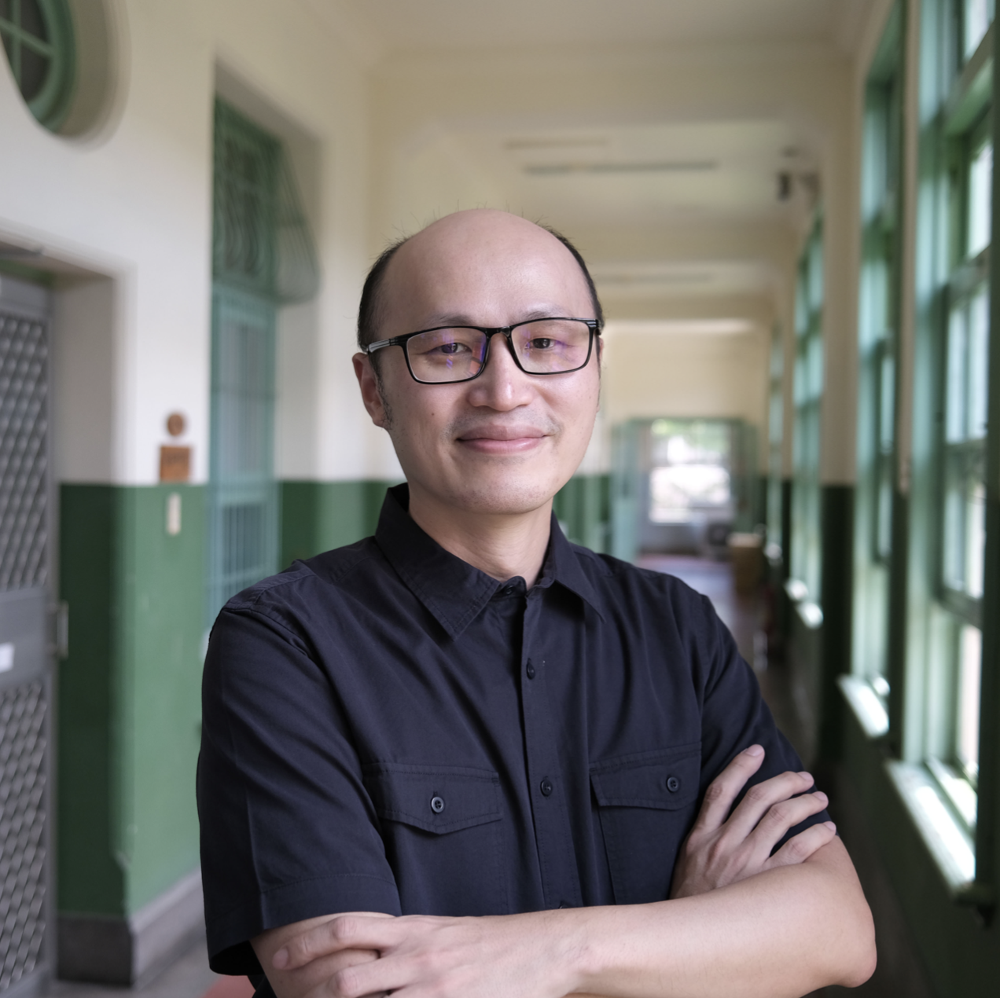
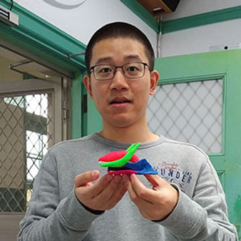
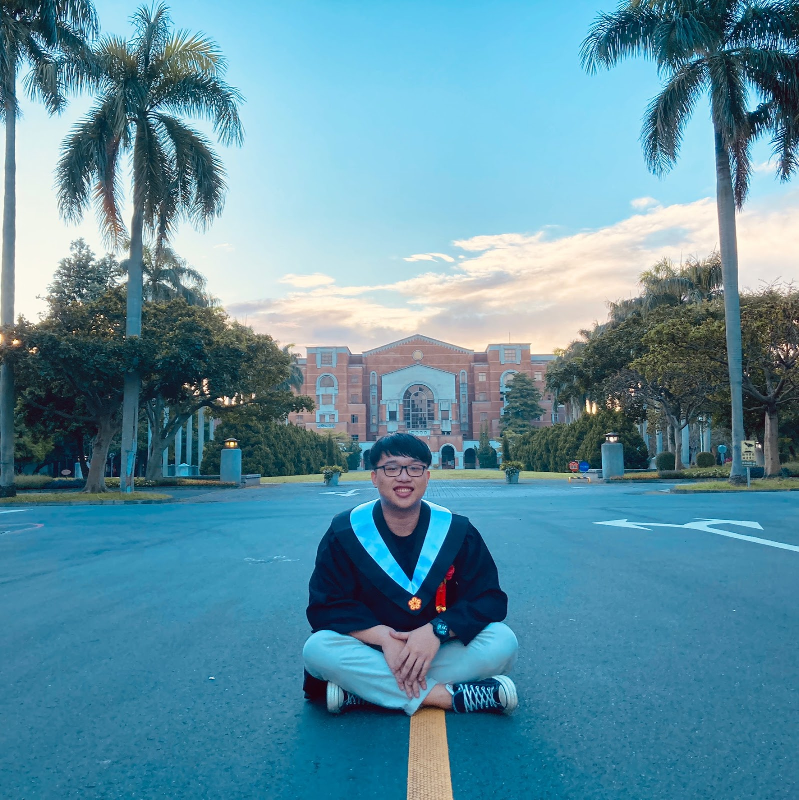
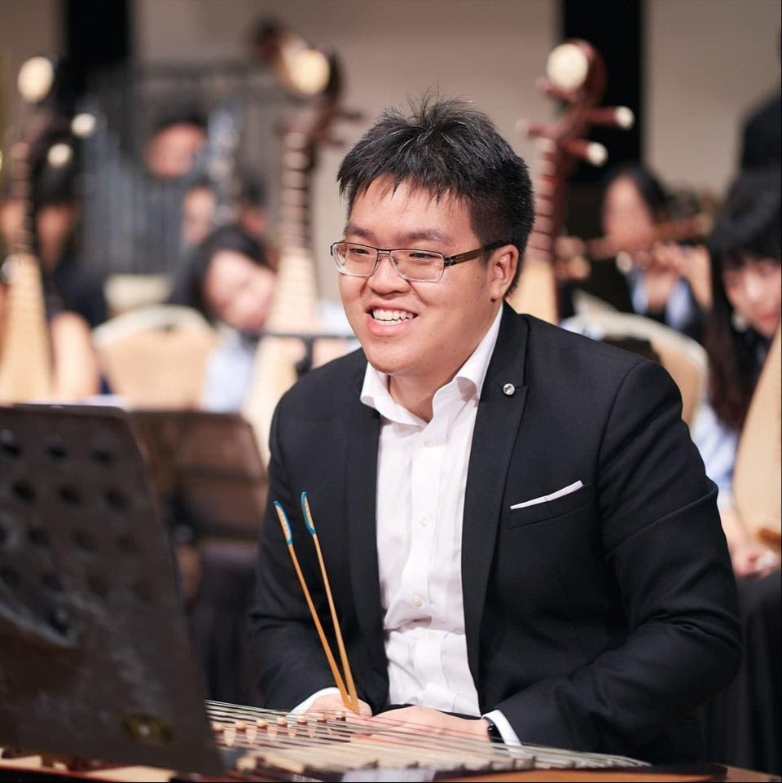
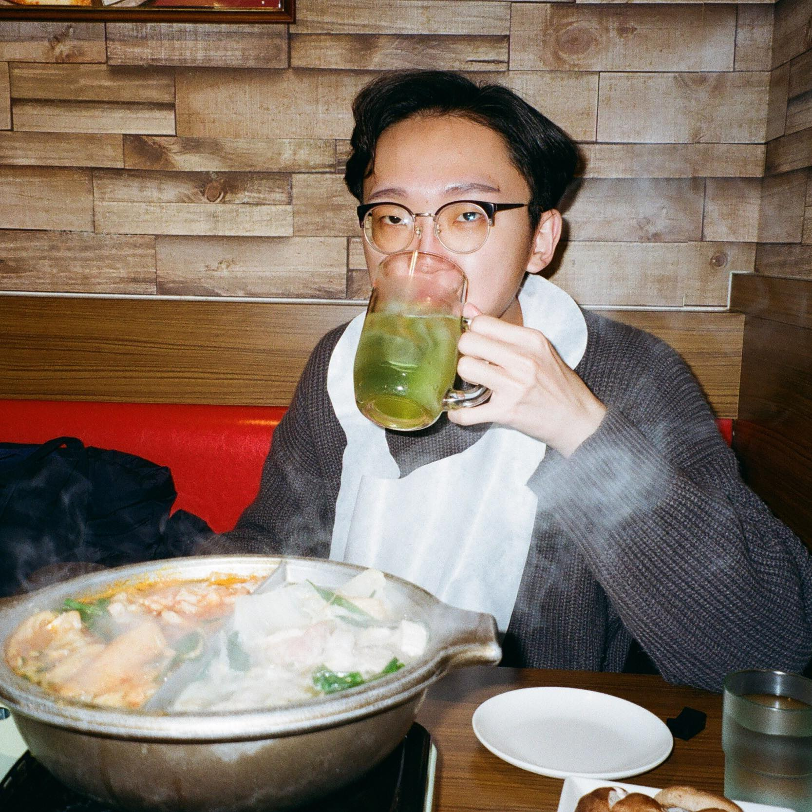
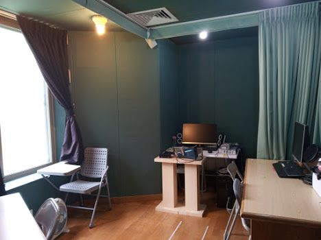
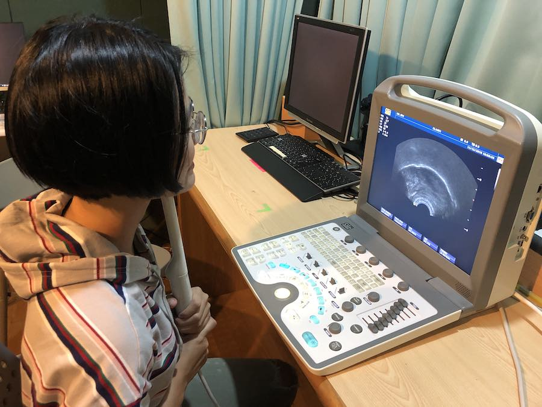
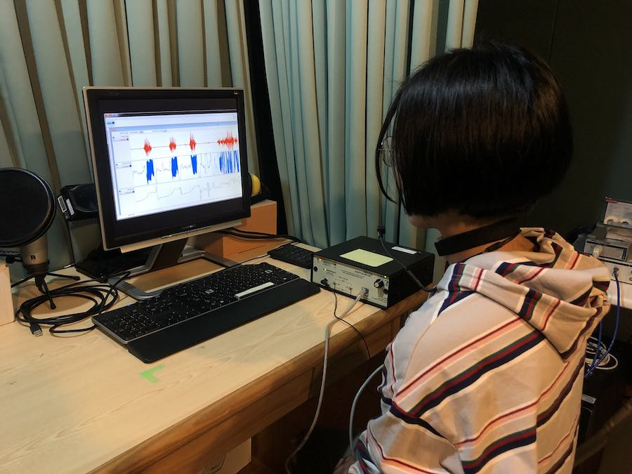
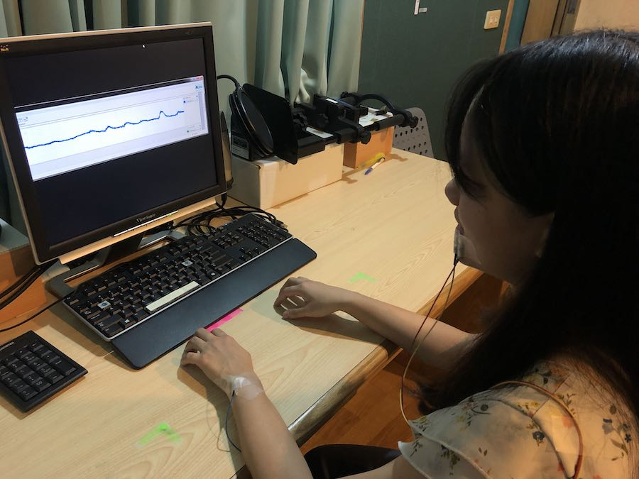

<!--  -->

## **The SBS Lab**

  In our lab, we are particularly interested in various kinds of speech behaviors across different
  body parts, including the larynx, the tongue, the lips, as well as the face. We use a number of
  equipment and techniques to examine and to understand the nature of speech sounds, how these
  sounds are produced, and the science behind them. Our lab uses imaging equipment, such as
  ultrasound to track movements, and we also have devices to record a wide range of electrical
  behaviors, including electromyography and electroglottography. The obtained speech signals and
  data can be further processed and analyzed through statistics. Analyzed data would be suitable for
  submission to pattern recognition and machine learning. Through these research, we hope to uncover
  both the psychological and physiological mechanisms that are employed during speech production and
  perception. These, we believe, would help us understand how language and speech performances can
  reflect human minds.

<iframe width="960" height="540" src="https://www.youtube.com/embed/8EV_7EfK4VE" title="YouTube video player" frameborder="0" allow="accelerometer; autoplay; clipboard-write; encrypted-media; gyroscope; picture-in-picture" allowfullscreen></iframe>

---

## **People**

### **Director**

  <ul>
    <li>
      <a href="https://sites.google.com/site/chiuchenhao/"> Prof. Chenhao Chiu 邱振豪 </a>
    </li>
    <li>
      PhD in Linguistics,  
      University of British Columbia,  
      Vancouver, Canada
    </li>
    <li>
      Research Interests:
      <ul>
        <li>Acoustic & articulatory phonetics</li>
        <li>
          Interaction between  
          speech perception & production
        </li>
        <li>Speech motor control</li>
        <li>Computational modeling</li>
        <li>Automated data analytics</li>
      </ul>
    </li>
  </ul>

  

### **Students**

  <figure class="revert">
    
    <figcaption>
      Sam Fisher 翁益寧  
      2nd year PhD
    </figcaption>
  </figure>
  <figure>
    
    <figcaption>
      Ray Chen 陳博煒  
      3rd year MA
    </figcaption>
  </figure>
  <figure>
    
    <figcaption>
      Benson Huang 黃柏瑄  
      3rd year MA
    </figcaption>
  </figure>
  <figure>
    
    <figcaption>
      Willy Wang 王麒瑋  
      3rd year MA
    </figcaption>
  </figure>
  <figure>
    
    <figcaption>
      Hess Huang 黃建誌  
      2nd year MA
    </figcaption>
  </figure>

---

## **Equipments**

  <figure class="revert">
    
    <figcaption>Sound Proof Recording Room</figcaption>
  </figure>
  <figure>
    
    <figcaption>US (Ultrasonography)</figcaption>
  </figure>
  <figure>
    
    <figcaption>EGG (Electroglottography)</figcaption>
  </figure>
  <figure>
    
    <figcaption>EMG (Electromyography)</figcaption>
  </figure>

---

## **Research Projects**

### **Acoustic-articulatory correspondences across different head angles**

  <ul>
    <li>Acoustics: Vowel spaces (F1-F2 measurements) across different head angles</li>
    <li>Articulation: tongue postures & centers across different head angles</li>
    <li>Speech motor control: the muscular control of tongue postures & head angles</li>
  </ul>

### **Mandarin high vowel rounding**

  <ul>
    <li>Automated data analytics: lip postures extracted through automated data collection</li>
  </ul>

### **Phonetic details in speech plan**

  <ul>
    <li>
      How musical training background affects speakers' production with respect to the duration and
      pitch of the target response? (Chiu, 2020)
    </li>
    <li>
      What are the physiological constraints associated with SAS-elicited response and how are they
      dissociated from pre-planned details?
    </li>
  </ul>

### **Auditory perturbation**

  <ul>
    <li>How can speech plans be performed in feedforward control?</li>
    <li>How does feedback affect the execution of speech plans?</li>
  </ul>

### **Taiwan Mandarin sound merger**

  <ul>
    <li>
      How tongue postures may contribute to such sound merging?
      <ul>
        <li>Nasal merging: Chiu and Lu (2021)</li>
        <li>Sibilant merging: Chiu et al. (2020)</li>
      </ul>
    </li>
  </ul>

### **Secondary articulatory in Horpa**

  <ul>
    <li>What is the mechanism of secondary articulation in vowels? (Chiu and Sun, 2020)</li>
  </ul>

---

## **Courses**

### **GIL required courses**

  <ul>
    <li>Introduction to Phonology (聲韻學)</li>
    <li>Linguistic fieldwork (語言學田野調查)</li>
  </ul>

### **GIL elected courses**

  <ul>
    <li>Physiological bases and functions in speech production (語言產出運動的生理基礎)</li>
    <li>Speech perception and production (語言感知與產出)</li>
    <li>Speech motor control (語言動作控制)</li>
    <li>The use of ultrasound for linguistic research (語言學超音波研究)</li>
  </ul>

### **GE courses**

  <ul>
    <li>Speech behaviors and speech Sciences (發音、行為與科學)</li>
    <li>Uncovering languages (探索語言)</li>
  </ul>

---

## **Participant Recruitment**

  Please refer to <a href="https://sbs-ntu.github.io/participant-recruitment/"> this link </a> (In
  Mandarin Chinese) for the participant recruitment of our latest experiments.

---

## **Events**

  <ol>
    <li>
      <a href="https://sbs-ntu.github.io/2021-ultrasound-workshop/"
        >Ultrasound in Linguistics Workshop 2021</a
      >
      (In Mandarin Chinese)
    </li>
    <li>Ultrafest XII (Planning)</li>
  </ol>

---

## **Resources**

  <ol>
    <li><a href="https://github.com/mktiede/GetContours">GetContours</a></li>
    <li><a href="https://github.com/WeirongChen/DeepEdge">DeepEdge</a></li>
    <li><a href="https://christophercarignan.github.io/TRACTUS/">TRACTUS</a></li>
    <li>Ultrasound Repository (Coming Soon)</li>
  </ol>

---

## **Contact Us**

  Please feel free to contact us via
  <a href="mailto:sbslab.ntu@gmail.com">sbslab.ntu@gmail.com</a> if you need any futher information.

