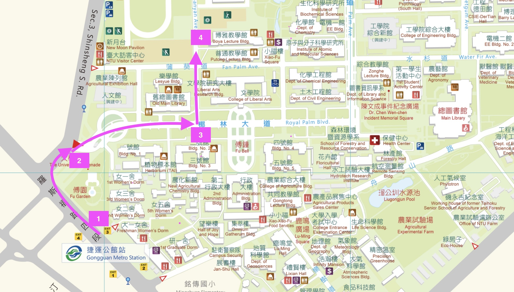

## `> 超音波只能用來看小寶寶嗎？` 
## `> 你知道超音波也能用來觀看並量測不同的發音部位嗎？`
## `> 想更了解超音波在語音學上的最新應用嗎？`

# ➲ 2021 臺大超音波工作坊將帶你一窺究竟！

---

## **工作坊介紹**

超音波儀近年來在語音相關研究上，逐漸成為國內外學界相當重要的研究利器。鑑於超音波的非侵入性特質以及即時成影的技術，超音波儀特別適合用來量測舌部運動與舌形姿態。本工作坊將介紹超音波在舌部運動的研究與應用，同時也規劃了實作課程，包括舌頭運動即時影像的錄製、影像資料擷取與後處理，以及介紹當前較為普遍的統計分析。臺大語言所發音行為與科學實驗室的老師以及研究生，手把手帶你瞭解超音波、解析口腔的發音運動！

---

## **工作坊流程**

工作坊日期：**2021 年 11 月 27 日 (星期六)**

時間|主題|講者|備註
:-----:|:-----:|:-----:|:-----:
9:30 ~ 10:10|語音研究的新利器：超音波|邱振豪| 
10:10 ~ 10:20|Break| | 
10:20 ~ 11:00|超音波是什麼？|翁益寧| 
11:10 ~ 11:20|Break| | 
11:20 ~ 12:00|超音波原來可以這樣看|邱振豪| 
 | | | 
12:00 ~ 13:30|Lunch break| | 
 | | | 
13:30 ~ 14:00|超音波動手玩！|翁益寧| 
14:00 ~ 14:40|影像分析 (I)|陳博煒| 畫面擷取與tracing
14:40 ~ 14:50 |Break| | 
14:50 ~ 15:30|影像分析 (II)|賴景泓| SS ANOVA + GAMMs
15:30 ~ 15:40|Break| | 
15:40 ~ 16:20|影像分析 (III)|黃柏瑄| PCA + LDA
16:20 ~ 17:00|綜合討論 Q&A| | 

---

## **講者介紹**

講者|介紹
:-----:|:-----:
邱振豪|國立臺灣大學語言所副教授、發音行為與科學實驗室主持人
翁益寧|國立臺灣大學語言所博士生
陳博煒|國立臺灣大學語言所碩士生
賴景泓|國立臺灣大學語言所碩士生
黃柏瑄|國立臺灣大學語言所碩士生

---

## **會場路線圖**

地點：國立臺灣大學博雅教學館 xxx 教室

會場路徑：

1. 公館捷運站三號出口
2. 延圍牆至台大校門口
3. 行經椰林大道，右轉至垂葉榕道
4. 直走，博雅教學館會在您的右手邊

[**點我看完整台大地圖**](https://www.ntu.edu.tw/about/map/B_02_A.jpg)

[**點我看 Google Map**](https://www.google.com/maps/place/%E5%9C%8B%E7%AB%8B%E8%87%BA%E7%81%A3%E5%A4%A7%E5%AD%B8%E5%8D%9A%E9%9B%85%E6%95%99%E5%AD%B8%E9%A4%A8/@25.0188496,121.5345114,17z/data=!3m1!4b1!4m5!3m4!1s0x3442a989d9909417:0x13a8ef0043681664!8m2!3d25.0188448!4d121.5367001)

---

## **報名資訊**

* 報名人數： 40 人
* 報名期間： To Be Announced
* 報名費用： To Be Announced
* 報名方式： To Be Announced

---

## **主辦單位**

* 台灣語言文化與資訊協會

* 國立臺灣大學語言學研究所  
發音行為與科學 實驗室

---

## **相關資源**
